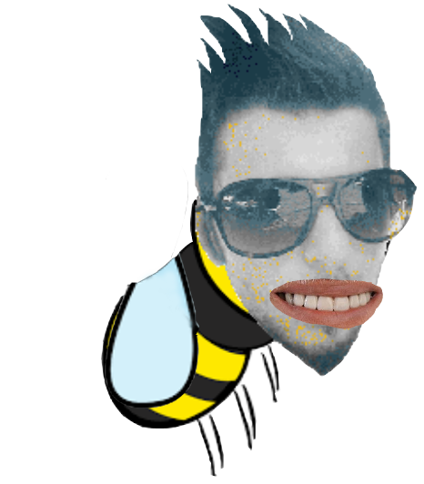

<!DOCTYPE html>
<html lang="en">
<head>
    <meta charset="UTF-8">
    <meta name="viewport" content="width=device-width, initial-scale=1.0">
    <title>Game</title>
    <link rel="stylesheet" href="style.css">
</head>
<body>
    

        
Character selection

        

            
            
            
        

        

            <a href="">Solo</a>
            <a href="">Co-op</a>
        

    

    
</body>
</html>
